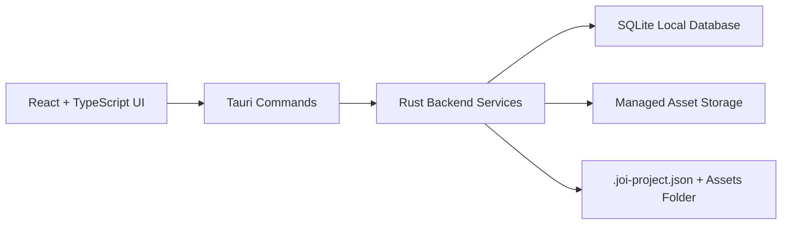

# Joi Agent

Joi Agent 是一款面向服装广告内容生产的本地优先 AI Agent 桌面应用。它围绕短视频广告、模拍图、商品图和多平台生成素材的工作流设计，帮助内容团队把品牌资料、项目 brief、素材、分镜、提示词、版本和长期记忆组织到一个可追踪、可复用的项目空间中。

Joi 的核心目标不是做一个泛用聊天机器人，而是成为服装广告创作链路中的专业工作台：理解品牌和商品，沉淀创意方向，组织分镜脚本，生成适配不同图像和视频模型的提示词，并把每次项目推进都保存成可回溯的结构化资产。

## What Joi Does

Joi Agent 聚焦服装广告内容工作流，主要服务这些场景：

- 为 15 到 30 秒服装广告短片规划分镜结构、镜头节奏和画面表达。
- 为服装模拍图、商品图、场景图生成高质量提示词。
- 将品牌风格、目标平台、商品卖点、视觉偏好和禁忌项沉淀为可复用上下文。
- 管理项目素材，包括本地图片、参考图、视频素材和生成结果。
- 保存项目版本快照，支持回看、比较和最小化回滚。
- 通过长期记忆记录品牌级、项目级和用户级偏好。
- 以 `.joi-project.json` 加 assets folder 的方式导入导出项目包。

## Core Capabilities

### Brand And Project Context

Joi 使用品牌和项目作为主要组织方式。品牌层承载长期稳定的信息，例如品牌调性、视觉偏好、常见场景、平台偏好和负面偏好；项目层承载某次具体广告任务，例如投放目标、视频时长、项目标题、素材和分镜方案。

这种结构让 Joi 可以在多个项目之间复用品牌理解，同时保持每个广告项目独立、可导出、可回滚。

### Fashion Advertising Workflow

Joi 的内容模型围绕服装广告而不是通用文案展开：

- Research reports: 记录资料检索、竞品观察、平台趋势和关键结论。
- Product understanding: 记录品类、人群、卖点、材质、版型和穿搭重点。
- Creative directions: 记录创意概念、视觉风格、场景方向和表达理由。
- Storyboards: 组织短视频广告的镜头序列。
- Shots: 记录单个镜头的时长、画面描述、运动方式、主体、场景和转场。
- Prompt packages: 保存面向图像或视频模型的正向提示词、负向提示词和平台适配信息。

这些对象让 Joi 可以把“灵感”变成结构化工作流，而不是只停留在一次性聊天记录里。

### Prompt Package Management

Joi 将提示词作为可管理资产保存，并区分平台与模态。提示词适配目标覆盖：

- 视频模型：即梦、Grok。
- 图像模型：Banana 2、即梦图片、GPT Image 2。
- 模态：视频、图像。
- 关系：提示词可以绑定到项目和具体镜头。

这样可以为同一个服装广告创意生成不同平台需要的 prompt，同时保留上下文和版本。

### Managed Local Assets

导入素材时，Joi 会把源文件复制到应用管理的本地资产目录，并在 SQLite 中记录元数据：

- asset kind
- display name
- relative path
- source URI
- MIME type
- file size
- SHA-256 hash

Joi 不依赖原始文件路径长期存在。导入后，项目资产由应用自己的 managed storage 管理，便于导出、快照和后续工作流引用。

### Project Snapshots

Joi 可以为项目创建完整 JSON 快照。快照包含项目核心信息、品牌上下文、素材、研究报告、商品理解、创意方向、分镜、镜头、提示词包和记忆条目。

快照用于：

- 保存项目关键版本。
- 回看创意迭代过程。
- 标记候选版本。
- 支持项目级最小回滚。
- 为导入导出提供稳定数据结构。

### Long-Term Memory

Joi 拥有自己的长期记忆账本，记忆按 scope 管理：

- user: 用户偏好。
- brand: 品牌长期偏好。
- project: 具体项目上下文和决策。

每条记忆包含内容、来源、置信度和状态。它不会把记忆直接写入外部 Agent runtime，而是先保存在 Joi 自己的数据层里，保证可审计和可迁移。

### Project Import And Export

Joi 使用开放的项目包格式：

```text
<project-slug>.joi-project.json
<project-slug>-assets/
```

`.joi-project.json` 保存结构化项目快照，assets folder 保存项目素材文件。这个格式便于团队备份、迁移、审阅和未来接入云同步或外部 Agent runtime。

## Architecture

Joi 采用本地优先桌面架构。前端负责交互，后端负责数据、文件、校验和命令边界。



### Frontend

- React
- TypeScript
- Vite
- Tauri JavaScript API

前端通过 Tauri commands 调用后端能力。它不直接写数据库，也不直接管理项目资产路径。

### Backend

- Rust
- Tauri 2
- rusqlite
- serde / serde_json
- chrono
- uuid
- sha2
- mime_guess

Rust 后端是 Joi 项目状态的 source of truth。它负责：

- SQLite 连接和迁移。
- 领域模型与校验。
- Repository 层数据读写。
- 文件导入和 hash。
- 项目快照。
- 项目包导入导出。
- Tauri command API。

### Local Persistence

Joi 使用 SQLite 保存结构化数据，并使用本地文件系统保存项目素材。数据库保存相对路径和元数据，不把文件 blob 存入表中。

主要数据对象包括：

- brands
- projects
- assets
- research_reports
- product_understandings
- creative_directions
- storyboards
- shots
- prompt_packages
- project_versions
- memory_entries

## Command Surface

Joi 的桌面前端通过 Tauri commands 访问后端。主要命令包括：

- `joi_health_check`
- `joi_create_brand`
- `joi_list_brands`
- `joi_get_brand`
- `joi_update_brand`
- `joi_create_project`
- `joi_list_projects`
- `joi_get_project`
- `joi_update_project`
- `joi_import_asset`
- `joi_list_assets`
- `joi_save_project_snapshot`
- `joi_list_project_versions`
- `joi_restore_project_version`
- `joi_export_project`
- `joi_import_project`
- `joi_create_memory_entry`
- `joi_list_memory_entries`

这些命令构成前端、工作流界面和未来 Agent runtime 之间的稳定边界。

## Repository Structure

```text
Joi-agent/
  src/
    App.tsx
    main.tsx
    styles.css
  src-tauri/
    src/
      assets.rs
      commands.rs
      db.rs
      error.rs
      lib.rs
      models.rs
      project_package.rs
      repositories.rs
      snapshots.rs
      validation.rs
    tests/
      asset_import.rs
      brand_project_repository.rs
      commands.rs
      db_migration.rs
      memory_ledger.rs
      project_export.rs
      project_import.rs
      project_snapshots.rs
      structured_content_repository.rs
  docs/
    superpowers/
      specs/
      plans/
      reports/
```

## Getting Started

### Requirements

- Node.js
- npm
- Rust toolchain
- Tauri desktop prerequisites for your operating system

### Install Dependencies

```powershell
npm install
```

### Run The Frontend Dev Server

```powershell
npm run dev
```

### Run The Tauri App

```powershell
npm run tauri:dev
```

### Build The Frontend

```powershell
npm run build
```

### Run Rust Tests

```powershell
cd src-tauri
cargo test
```

## Design Principles

- Local-first: project state and assets are usable without a remote service.
- Structured workflow over chat history: core content decisions become typed records.
- Domain-specific over generic: the data model is built for fashion advertising workflows.
- Auditable memory: long-term memory is stored as explicit records with scope and status.
- Stable import/export: projects can be moved through a transparent JSON package format.
- Backend-owned integrity: file paths, SQLite constraints, enum values and package schemas are validated in Rust.

## Product Direction

Joi Agent is intended to grow into a specialized creative operations agent for fashion advertising teams. The long-term direction is to connect the local project foundation with AI planning, research, prompt generation, storyboard generation, image/video model adapters, and selected open-source Agent runtimes while keeping Joi's product workflow and data ownership intact.

## License

This repository is licensed under the terms included in `LICENSE`.
